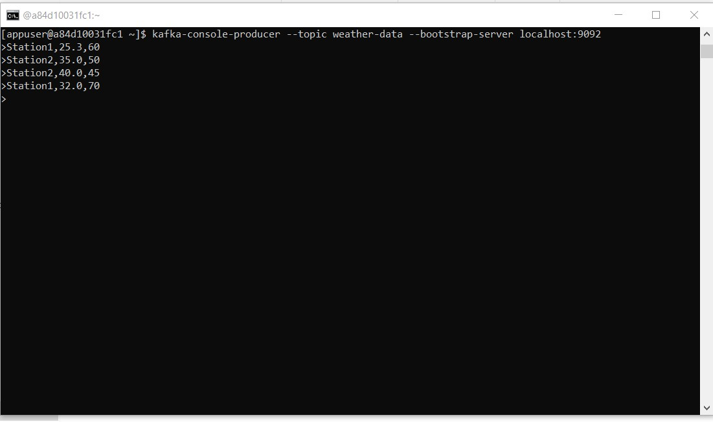
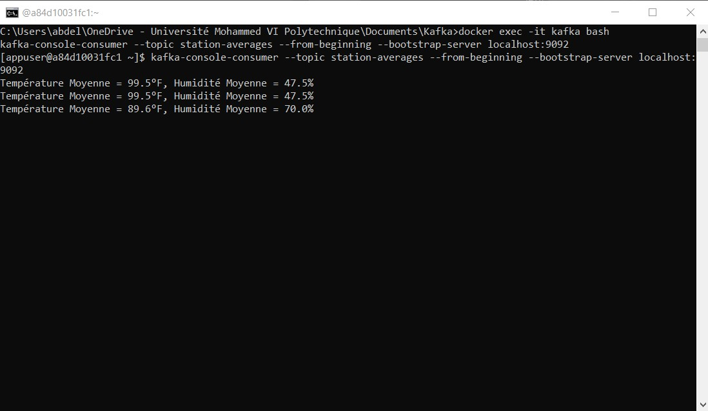
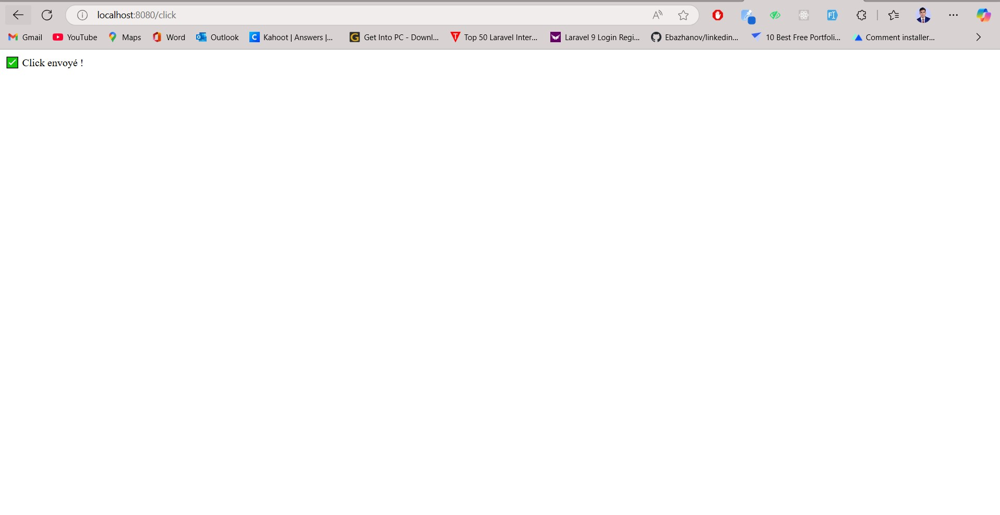
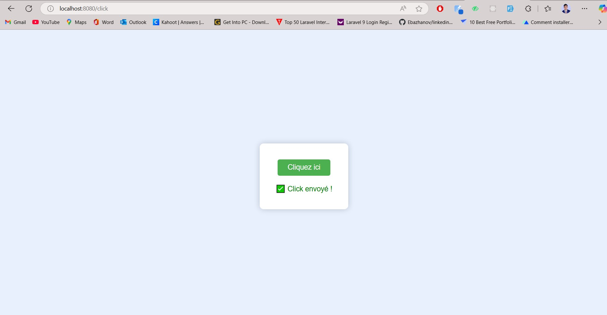
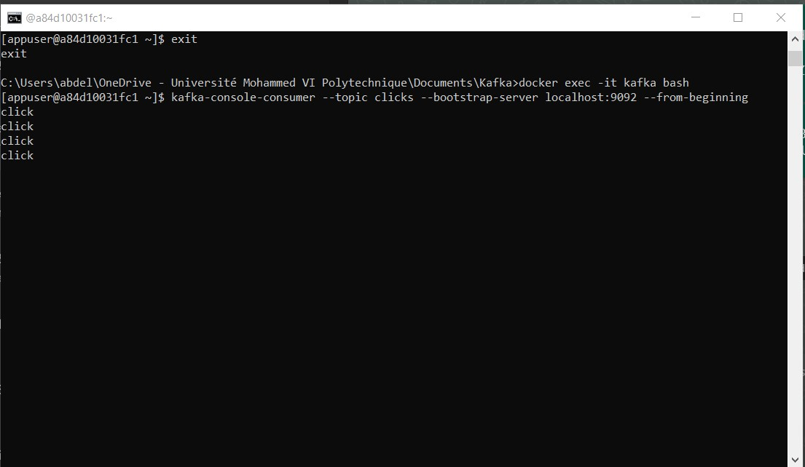
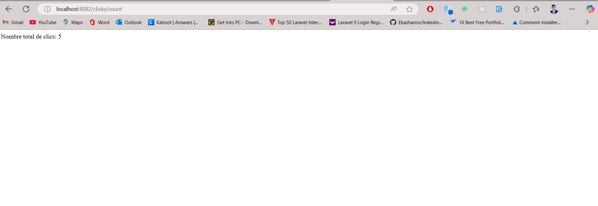
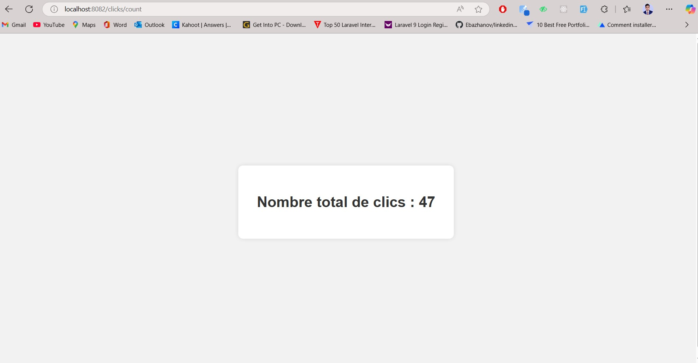

# Projet Kafka Streams - Exercice 1 & 2

## Auteur : Abdellah Lambaraa
> Big Data Processing 2024 – Encadré par M. Abdelmajid BOUSSELHAM

---

## 📌 Exercice 1 : Traitement de Données Météo avec Kafka Streams

### 🎯 Objectif :
Consommer des données météorologiques depuis le topic `weather-data`, convertir les températures Celsius en Fahrenheit, filtrer celles > 30°C, puis calculer la température et l'humidité moyennes par station. Le résultat est publié dans `station-averages`.

### 🔄 Pipeline :
1. **Producteur (Kafka CLI)** :
   ```bash
   kafka-console-producer --topic weather-data --bootstrap-server localhost:9092
   Station1,35.0,45
   Station2,40.0,60
   ```

2. **Kafka Streams (Java)** :
   - Filtrage
   - Transformation en Fahrenheit
   - Agrégation

3. **Résultat (topic `station-averages`)** :
   ```bash
   kafka-console-consumer --topic station-averages --from-beginning --bootstrap-server localhost:9092
   Température Moyenne = 95.0°F, Humidité Moyenne = 52.5%
   ```

4. **Interface Design (exemple)** :
### Insertion des données de la station
   
### Affichage des données de la station
   


---

## 📌 Exercice 2 : Compteur de clics avec Spring Boot & Kafka Streams

### 🧱 Architecture :
- `click-producer` (Spring Boot) : interface web avec un bouton
- `click-processor` (Kafka Streams) : traitement temps réel
- `click-api-consumer` (Spring Boot) : API REST exposant le nombre de clics

### 🔘 Producteur Web (port 8080) :
- URL : http://localhost:8080/click
- Envoie `"click"` dans le topic `clicks`
- Affiche une page HTML avec bouton et message de confirmation
### Page simple de clic


### Page de clic bien conçue


### liste des clicks


### 🔄 Traitement Streams :
- Compte les occurrences du message `"click"`
- Publie dans le topic `click-counts`

### 📊 API REST (port 8082) :
- URL : http://localhost:8082/clicks/count
- Résultat : `Nombre total de clics : 47`

### Affichage simple du nombre de clics


### Affichage stylisé du total de clics



---

## 📜 Résumé des Topics Kafka :
| Topic             | Description                          |
|-------------------|--------------------------------------|
| weather-data      | Données météo                        |
| station-averages  | Moyennes des stations (°F et %)      |
| clicks            | Clics envoyés depuis l'interface      |
| click-counts      | Nombre total de clics                |
|                  |                                      |

## ✅ Outils & Technologies :
- Java 21
- Spring Boot 3.5.x
- Apache Kafka 3.x
- Docker (pour Zookeeper & Kafka)
- IntelliJ IDEA

---

© 2024 – Projet académique ENSET Mohammedia – Big Data & Cloud Computing
